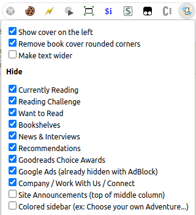

# CleanerReads - A Goodreads Theme
Muting and moving some UI elements in favor of text. Nothing changed, just rearranged.

### Before

### After

### Settings

## Install
[Userstyle][4] - [Userscript][1] - [Firefox][2] - [Chrome][3].

## Changes
⚠️ **New in v1.4.0:** option button now in the top right corner cog **⚙** button;

- **sidebar** to the right, don't know if it helps much
- **topbar** to the sidebar, that orange/purple strip on the top (cut from screenshot, but it's there)
- **navbar** nearly invisible and hidden on scroll
- **duplicated elements** removed, like user stars, author info
- **book description** always expanded
- **social info** and buttons with less emphasis
- **reviews** centralized on page, user info moved to the left
- **reviews** with less characters per row
- **options**
  - show cover on the left
  - make text wider
  - hide elements from front page
  - move About Author and Readers Also Enjoyed to the sidebar

**WORKS BEST ON 1920x1080**

## Changelog
- v1.4.0
    - option button now in the top right corner cog **⚙** button
    - a lot of the code changed, please let me know if I broke something
    - fix "category underlines cross out the category names"
    - fix "Readers also enjoyed not actually moving to the sidebar"

## Contributing
See [here](node_modules/@icetbr/run-config/common.sh) for dev scripts
See [here](node_modules/@icetbr/rollup-config-webext/dev.js) for rollup config

[Contributing](https://github.com/icetbr/my-projects/blob/main/CONTRIBUTING.md)\
[License (MIT)](https://choosealicense.com/licenses/mit/)

[1]: https://openuserjs.org/scripts/icetbr/CleanerReads_-_A_Goodreads_Theme
[2]: https://addons.mozilla.org/en-US/firefox/addon/cleanerreads
[3]: https://chrome.google.com/webstore/detail/cleanerreads/pfckicghmjgghmoeolegcbccjekhejji
[4]: https://userstyles.world/style/8034/cleanerreads-a-goodreads-theme
