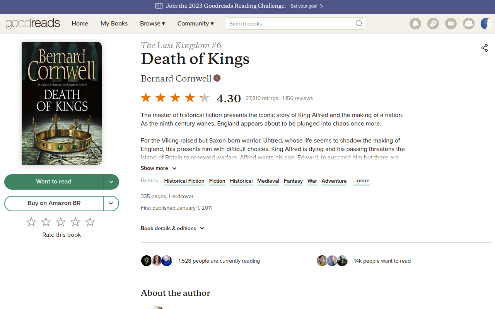
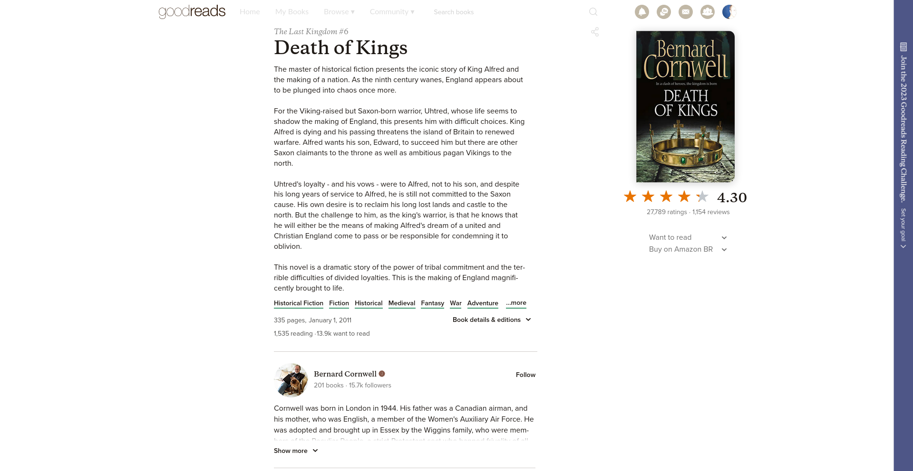

# CleanerReads - A goodreads.com Theme
Nothing removed, just muted or moved out of the way.

### Before

### After

## Install
[Userstyle][4] - [Userscript][1] - [Firefox][2] - [Chrome][3].

## Changes
- **sidebar** to the right, don't know if it helps much
- **topbar** to the sidebar, that orange/purple strip on the top (cut from screenshot, but it's there)
- **navbar** nearly invisible and hidden on scroll
- **duplicated elements** removed, like user stars, author info
- **book description** always expanded
- **social info** and buttons with less emphasis
- **reviews** centralized on page, user info moved to the left
- **reviews** with less characters per row

**WORKS BEST ON 1920x1080**

[Contributing](https://github.com/icetbr/my-projects/blob/main/CONTRIBUTING.md)\
[License (MIT)](https://choosealicense.com/licenses/mit/)

[1]: https://openuserjs.org/scripts/icetbr/CleanerReads_-_A_goodreads.com_Theme
[2]: https://addons.mozilla.org/en-US/firefox/addon/cleanerreads
[3]: https://chrome.google.com/webstore/detail/cleanerreads/pfckicghmjgghmoeolegcbccjekhejji
[4]: https://userstyles.world/style/8034/cleanerreads-a-goodreads-theme
