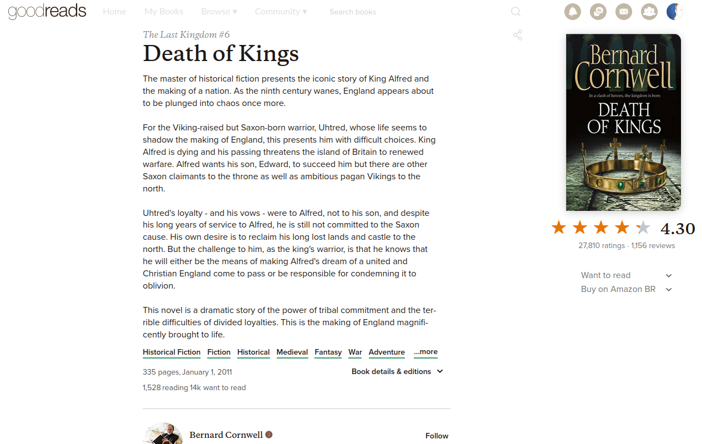

# CleanerReads - A goodreads.com Theme
Nothing removed, just muted or moved out of the way.

### Before

### After

## Install
[Userscript][1] - [Firefox][2] - [Chrome][3].

## Changes
- sidebar to the right, don't know if it helps much
- moved top bar (orange, blue) to the sidebar
- `topbar` non sticky and nearly invisible
- removed some duplicated elements (user stars, author info)
- book description always expanded
- less emphasis on social info and buttons
- review text centralized on page, poster info moved to the right
- review text is narrower

## [Contributing](https://github.com/icetbr/my-projects/blob/main/CONTRIBUTING.md)
## License
[MIT](https://choosealicense.com/licenses/mit/)

[1]: https://openuserjs.org/users/icetbr/scripts
